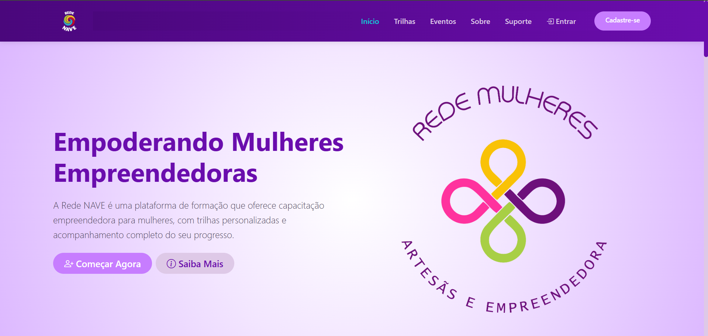

# REDE NAVE – FRONT END

Interface web da plataforma Rede Nave, focada em educação, trilhas de aprendizagem
e eventos, com design moderno, responsivo e acessível.

## 🚀 Aplicação Online

A aplicação está disponível e pode ser acessada através do seguinte link:

🔗 **[rede-nave-front.vercel.app](https://rede-nave-front.vercel.app)** 


## 📸 Preview

Abaixo uma captura de tela da interface para uma prévia visual:




## 🧰 Tecnologias

- React + TypeScript
- React Router DOM
- Bootstrap 5 (Offcanvas, Grid, Utilities)
- CSS Custom Properties (Design System)
- Vite
- Storyblok (CMS Headless)

## 🚀 Como rodar localmente

### Clone o repositório
```bash
git clone https://github.com/Hicaro-Andre/RedeNave-Front.git
```
<!-- ### Entre na pasta
```bash
cd rede-nave-front
``` -->
### Instale as dependências
```bash
npm install
```
### Rode o projeto
```bash
npm run dev
```

## 📁 Estrutura do projeto

```md
src/
├── assets/                   # Imagens, ícones, logos, banners
│
├── components/               # Componentes e páginas organizadas por domínio
│   ├── About/
│   ├── Administrator/
│   ├── Chatbot/
│   ├── Courses/
│   ├── Dashboard/
│   ├── Eventos/
│   ├── HomePage/
│   ├── Login/
│   ├── Privacy/
│   ├── Register/
│   ├── Support/
│   ├── Trails/
│   │
│   ├── BackToTop.tsx          # Componentes reutilizáveis
│   ├── Footer.tsx
│   ├── LoadingSpinner.tsx
│   ├── NavBar.tsx
│   └── NotFound.tsx
│   └── ScrollToTop.tsx
│
├── config/                     # Configurações 
│   └── admin.ts
│   └── firebase.ts
│   └── storyblok.ts
│
├── context/ 
│   └── AuthContext.tsx
│
├── pages/                      # Páginas (rotas da aplicação)
│   ├── About.tsx
│   ├── Admin.tsx
│   ├── Course.tsx
│   ├── Dashboard.tsx
│   ├── Events.tsx
│   ├── Home.tsx
│   ├── Login.tsx
│   ├── PrivacyPolicy.tsx
│   ├── Register.tsx
│   ├── Support.tsx
│   └── Trails.tsx
│
├── services/                   # Autenticação de Login
│   ├── authService.ts
│   ├── eventService.ts
│   ├── trackService.ts
│
├── styles/                     # Estilos por página
│   ├── about.css
│   ├── admin.css
│   ├── animations.css
│   ├── coursedetail.css
│   ├── dashboard.css
│   ├── events.css
│   ├── home.css
│   ├── login.css
│   ├── privacypolicy.css
│   ├── register.css
│   └── support.css
│   └── trails.css
│
├── App.tsx                    # Composição principal da aplicação
├── index.css                  # CSS global
├── main.tsx                   # Ponto de entrada (Vite)
└── vite-env.d.ts              # Tipagens do Vite

```

## 🧠 Decisões técnicas
<!-- - Navbar com efeitos de scroll otimizados usando `requestAnimationFrame` -->
- CSS organizado com variáveis globais (`:root`) para facilitar manutenção
- Navbar com efeitos visuais baseados em scroll
- Componentes documentados diretamente no código
- O uso do Storyblok como CMS headless para separar
conteúdo de código.

```md
# Storyblok

## Por que foi usado?
Permitir edição de conteúdo sem alterar código.

Com isso:
- textos, imagens e banners podem ser atualizados sem novo deploy
- o front-end fica mais organizado
- o projeto simula um cenário real de produto

## O que é gerenciado?
- Títulos
- Textos
- Imagens
- Cards e seções

## O que NÃO é responsabilidade do Storyblok
- Lógica de navegação
- Regras de negócio
```

```md
## 📝 Páginas configuradas via Storyblok

As seguintes páginas da aplicação são integradas com o Storyblok, permitindo que o conteúdo seja gerenciado dinamicamente:

- Home 
- Trilhas 
- Eventos 
- Sobre
- Suporte 
- Login  
- Cadastro  

> Observação: O conteúdo dessas páginas é gerenciado pelo Storyblok e renderizado dinamicamente no front-end usando `<StoryblokComponent />`.

```

## 🧩 Componentes principais

### App

**Responsável por:**
- Estrutura base da aplicação
- Configuração das rotas (React Router)
- Composição do layout global (Navbar, Footer e Pages)

**Arquivo:**  
`src/App.tsx`

---

### Navbar

**Responsável por:**
- Navegação principal da aplicação
- Destaque da rota ativa
- Menu mobile (Offcanvas)
- Barra de progresso baseada em scroll

**Arquivo:**  
`src/components/Navbar.tsx`

---

### Footer

**Responsável por:**
- Exibir informações institucionais
- Links úteis (Sobre, Suporte, Privacidade, etc.)
- Encerramento visual da aplicação

**Arquivo:**  
`src/components/Footer.tsx`

---

### BackToTop

**Responsável por:**
- Detectar o scroll da página
- Exibir botão de retorno ao topo
- Melhorar a experiência do usuário em páginas longas

**Arquivo:**  
`src/components/BackToTop.tsx`

---

### LoadingSpinner

**Responsável por:**
- Exibir feedback visual durante carregamentos
- Indicar requisições em andamento
- Melhorar a percepção de performance

**Arquivo:**  
`src/components/LoadingSpinner.tsx`

---

### NotFound

**Responsável por:**
- Exibir página de erro 404
- Tratar rotas inexistentes
- Orientar o usuário em caso de navegação inválida

**Arquivo:**  
`src/components/NotFound.tsx`

---

## 🤖 Chatbot de Suporte

A aplicação conta com um **chatbot interativo**, desenvolvido para auxiliar usuários
com dúvidas frequentes sobre a plataforma, navegação, cursos e eventos.

### Objetivos do Chatbot
- Melhorar a experiência do usuário
- Oferecer suporte rápido e contextual
- Simular um atendimento automatizado comum em plataformas educacionais

### Características técnicas
- Desenvolvido com React + TypeScript
- Componentização por domínio (`Chatbot/`)
- Mensagens e opções desacopladas da lógica
- Fácil expansão para integração futura com API ou IA

### Estrutura

```md
components/Chatbot/
├── Chatbot.tsx
├── ChatMessage.tsx
├── ChatOptions.tsx
├── ChatbotData.ts
└── Chatbot.css
```
---

## 🎨 Design System

As cores e estilos globais são centralizados em variáveis CSS para garantir consistência visual e facilitar manutenção.

```css
:root {
  --bg-color-navbar: linear-gradient(90deg, #4a077c, #6a0dad);
  --bg-color-button: #c77dff;
}
```

## 👤 Autores

```md
## Hicaro André -  
Desenvolvedor  Full Stack  

## Luana Reis - 
Desenvolvedora Front-end 

## Rosélia Cristina - 
Desenvolvedora Front-end 
```

## 📄 Licença
Este projeto está sob a licença MIT.

---

## 🔗 Back-end / API

Este projeto utiliza **Firebase** para gerenciar todas as funcionalidades de back-end, incluindo:

- Autenticação de usuários (Google, Facebook, Email/Senha)
- Banco de dados em tempo real com **Firestore**
- Armazenamento de arquivos com **Firebase Storage**
- Funções serverless com **Firebase Functions** (se aplicável)

Não é necessário um repositório de API separado, pois toda a lógica do back-end está integrada diretamente com o Firebase.


---

## 🎓 Contexto Educacional (Softex)

Este projeto foi desenvolvido como parte do programa da Softex,
com foco em boas práticas de front-end, organização de código,
responsividade e experiência do usuário.


