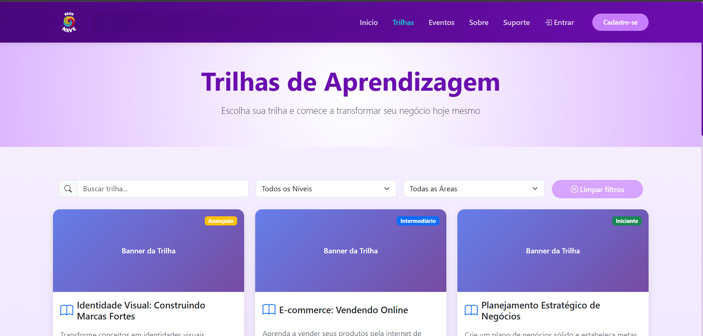
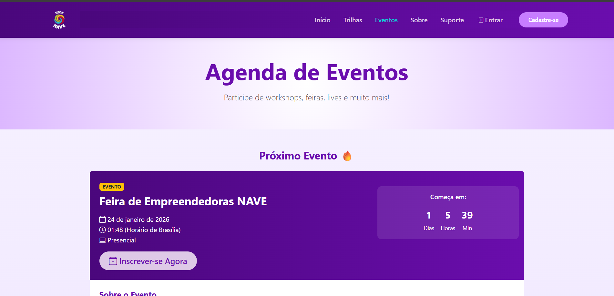
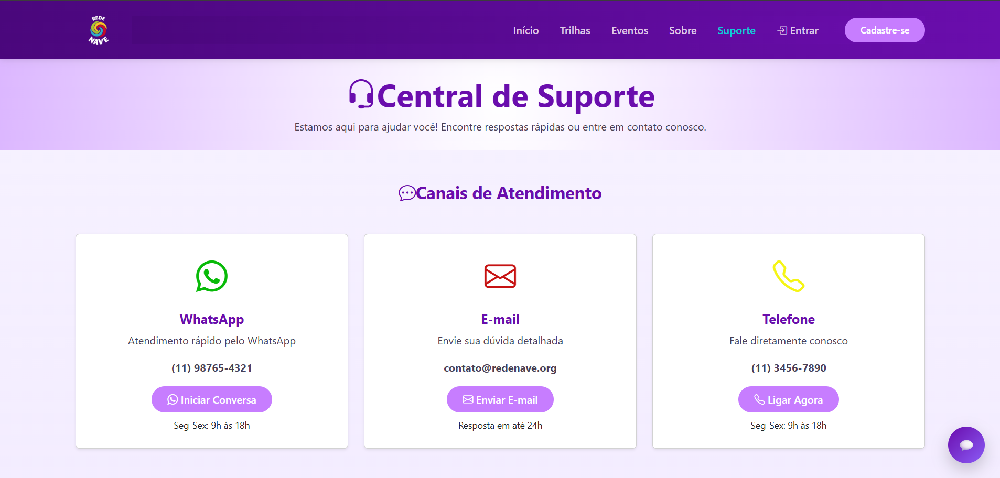
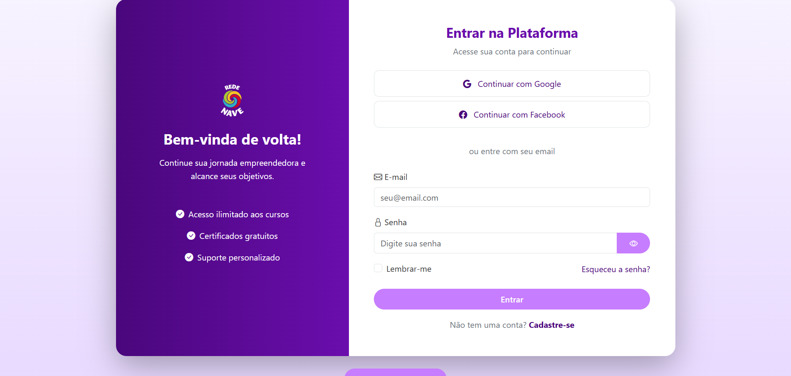
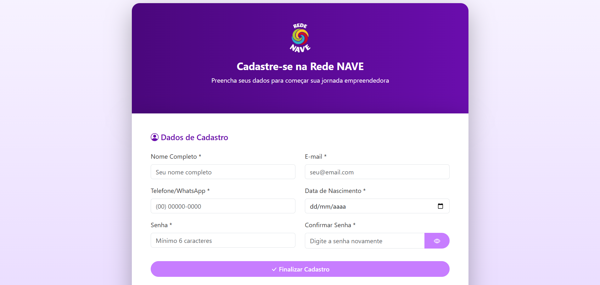
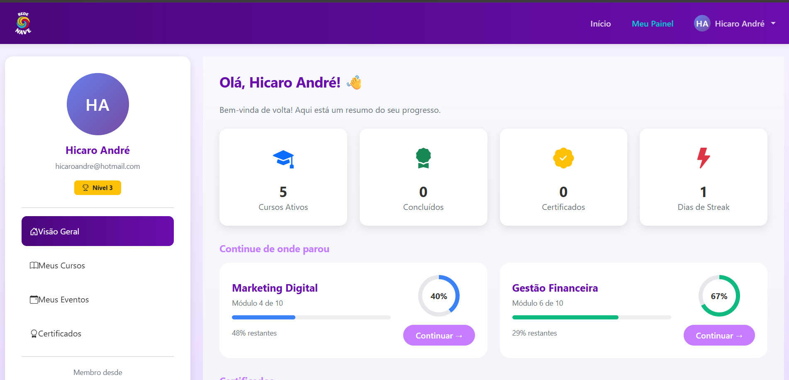
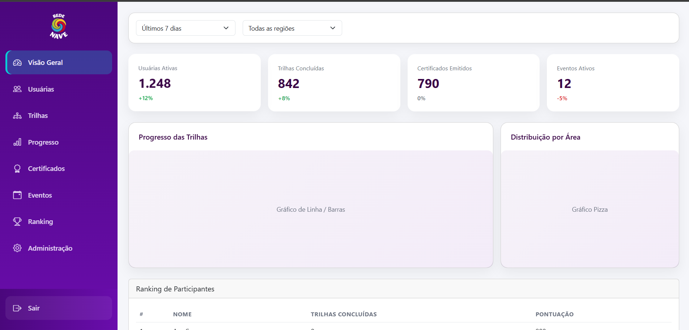

## 6 - 🔧📄 DOCUMENTAÇÃO DAS FUNCIONALIDADES

Esta documentação descreve as funcionalidades da plataforma, cobrindo interface, estrutura e detalhes técnicos. Seu propósito é auxiliar tanto na avaliação quanto na manutenção e evolução futura do projeto.

---

### Funcionalidade 1 - **Trilhas de Aprendizagem Personalizadas**

Abaixo uma captura de tela da interface para uma prévia visual:

Link disponível para melhor visualização
🔗 **[rede-nave-front.vercel.app](https://rede-nave-front.vercel.app/trilhas)** 

-descrisão

---

### Funcionalidade 2 - **Agenda de Cursos e Eventos**

Abaixo uma captura de tela da interface para uma prévia visual:

Link disponível para melhor visualização
🔗 **[rede-nave-front.vercel.app](https://rede-nave-front.vercel.app/eventos)** 

-descrisão

---

### Funcionalidade 3 - **Canal de Comunicação e Suporte**

Abaixo uma captura de tela da interface para uma prévia visual:

Link disponível para melhor visualização
🔗 **[rede-nave-front.vercel.app](https://rede-nave-front.vercel.app/suporte)** 

-descrisão

---

### Funcionalidade 4 - **Tela Login**

Abaixo uma captura de tela da interface para uma prévia visual:

Link disponível para melhor visualização
🔗 **[rede-nave-front.vercel.app](https://rede-nave-front.vercel.app/login)** 

-descrisão

---

### Funcionalidade 5 - **Tela Cadastro**

Abaixo uma captura de tela da interface para uma prévia visual:

Link disponível para melhor visualização
🔗 **[rede-nave-front.vercel.app](https://rede-nave-front.vercel.app/cadastro)** 

-descrisão

---

### Funcionalidade 6 - **Painel de Acompanhamento (Usuário)**

Abaixo uma captura de tela da interface para uma prévia visual:

Link disponível para melhor visualização
🔗 **[rede-nave-front.vercel.app](https://rede-nave-front.vercel.app/dashboard)** 

-descrisão

---

### Funcionalidade 7 - **Painel de Administração e Certificação**

Abaixo uma captura de tela da interface para uma prévia visual:

Link disponível para melhor visualização
🔗 **[rede-nave-front.vercel.app](https://rede-nave-front.vercel.app/admin)** 

-descrisão

---

⬅️ [Voltar](../docs/README.md)